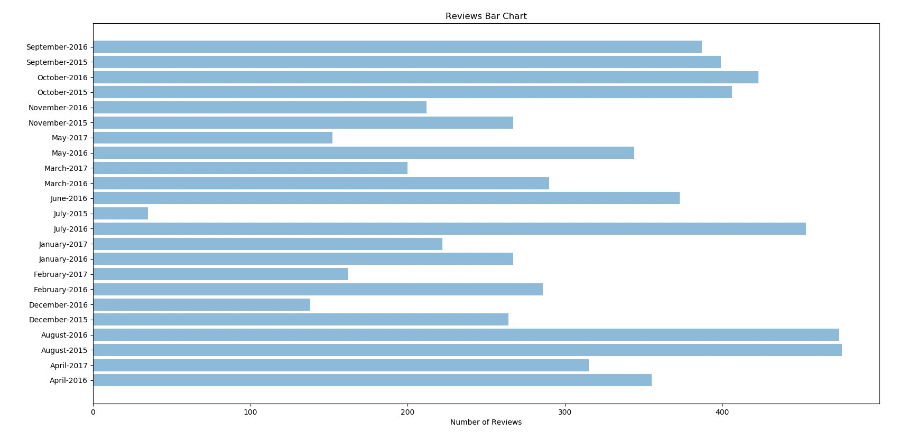

# Relatório

## Descrição do ambiente utilizado para execução das aplicações Hadoop;

O ambiente utilizado foi um container docker contendo todos os sistemas necessários baseado [neste repositório](https://github.com/audip/hadoop-python-streaming).
Nele estão contidas as ferramentas do hadoop, as aplicações que se comunicam entre si e é possível acessá-las através das portas abertas pelo docker.
Como nós fizemos classes de _mappers_ e _reducers_ feitas em python, utilizamos no ambiente um arquivo de streaming do hadoop na versão _2.6.0_ para importar os códigos e executar as operações necessárias.

## Explicação de como cada item foi respondido 

### Questão 2 

#### item a) Quais foram as hashtags mais usadas pela manhã, tarde e noite? (1,0 ponto)

Primeiro foi feito um mapping com a chave sendo o turno e o valor sendo a hashtag na mensagem. O reducer agrupa as hashtags de cada turno e conta a quantidade.

Estes foram os resultados obtidos:

**Tarde**

| Hashtag  | Quantidade  
|----------|------------|
|  EMABiggestFans1D            | 40843 |
|  EMABiggestFansJustinBieber  | 36177 |   
|  QueroNoTVZ                  | 4032  | 
|  EMABiggestFansJustinBieber" | 1033  |   
|  ChristianNoEncontroComFatima| 709   |   

**Noite**

| Hashtag  | Quantidade  
|----------|------------|
|  EMABiggestFans1D                | 145303 |
|  EMABiggestFansJustinBieber      | 136957 |   
|  camilasayshi                    | 9915   | 
|  StealMyGirl                     | 6517   |   
|  EMABiggestFansJustinBieber      | 4246   |   

**Manhã**

| Hashtag  | Quantidade  
|----------|------------|
|  EMABiggestFansJustinBieber | 24324 |
|  EMABiggestFans1D           | 23856 |
|  trndnl                     |  873  | 
|  VoteVampsTeenAwards        |  863  |   
|  AustinMahoneChile          |  537  | 

#### item b)  Quais as hashtags mais usadas em cada dia? (1,0 ponto)

Primeiro foi feito um mapping com a chave sendo a data e o valor sendo a hashtag na mensagem. O reducer agrupa as hashtags de cada data e conta a quantidade.

Estes foram os resultados obtidos:

**5**
| Hashtag | Quantidade 
| --------|------------|
|#EMABiggestFans1D|              33749
|#EMABiggestFansJustinBieber|    26216
|#StealMyGirl|                    6065
|#bigpaynodanceoff|               4008
|#AssistamODR|                    2406

**16**
| Hashtag | Quantidade
| --------| -----------|
|#EMABiggestFans1D|              66619
|#EMABiggestFansJustinBieber|    56040
|#camilasayshi|                   9957
|#DebateNoSBT|                    3113
|#CartersNewVideo|                3099

**17**
| Hashtag | Quantidade 
| ------- | ----------|
|#EMABiggestFansJustinBieber|     46921
|#EMABiggestFans1D|               46416
|#QueroNoTVZ|                      2930
|#TheVoiceBrasil|                  2653
|#EMABiggestFansJustinBieber"|     1585

**18**
|Hashtag | Quantidade
| -----  | ---------- |
|#EMABiggestFans1D|                26802
|#EMABiggestFansJustinBieber      26256
|#QueroNoTVZ|                       2379
|#demiyourstorydoesntdefineyou|     1022
|#WeWantZaynsSongsInFOUR|            880

**19**
|Hashtag| Quantidade
| ----- | ----------|
|#EMABiggestFansJustinBieber|      32016
|#EMABiggestFans1D|                29119
|#LuanSantanaNaHoraDoFaro|          3058
|#LinkinParkNoMultishow|            1842
|#demiyourstorydoesntdefineyou|     1229

**20**
|Hashtag| Quantidade
| ----- | ----------|
|#EMABiggestFansJustinBieber|    10009
|#EMABiggestFans1D|               7297
|#DebateNaRecord|                 2245
|#QueroDilmaTreze|                1817
|#debatenarecord|                 1761

#### item c) Qual o número de tweets por hora a cada dia? (1,0 ponto)

Primeiro foi feito um mapping com a chave sendo a data e o valor sendo a hora da mensagem. O reducer agrupa as horas de cada data e conta a quantidade.

Estes foram os resultados obtidos:

**15**
| Hora | Quantidade
| ---- | --------- |
|23|    97589
|22|    86037
|17|    83956
|21|    79278
|15|    79168
|16|    78363
|18|    77716
|20|    66820
|19|    65103
|14|    34380

**16**
| Hora | Quantidade
| ---- | ----------|
|02|    176225
|01|    163357
|03|    124614
|00|    110250
|22|     99455
|23|     93364
|21|     88485
|16|     79292
|04|     77749
|15|     76896
|20|     68165
|14|     66157
|17|     65831
|19|     58552
|18|     57105
|13|     55960
|12|     49163
|11|     42721
|05|     42667
|10|     37532
|09|     23618
|06|     22230
|07|     10159
|08|      8327

**17**
| Hora | Quantidade
| ---- | --------
|02|    153989
|01|    142784
|03|    122216
|00|   107999
|04|     76954
|16|     74914
|15|     74755
|14|     66981
|20|     65614
|17|     65010
|13|     59857
|18|     58848
|19|     57843
|23|     54062
|22|     53502
|21|     53149
|12|     48147
|05|     42225
|11|     40920
|10|     35149
|06|     20986
|09|     20563
|07|     10695
|08|      8018

**18**
| Hora | Quantidade
| ---- | ----------|
|15|    75211
|16|    72340
|14|    71411
|17|    69005
|23|    68668
|22|    65108
|18|    63706
|02|    63504
|19|    61734
|01|    61059
|21|    60674
|20|    59172
|13|    58389
|03|    56569
|00|    55413
|04|    42781
|12|    41490
|05|    37155
|11|    27496
|06|    27475
|07|    17727
|10|    17460
|08|    12109
|09|    11540

**19**
Hora | Quantidade
| ---| ----------|
|03|    97584
|23|    95094
|02|   89896
|22|    86636
|01|    80645
|18|    80196
|04|    77494
|19|    77269
|21|    77039
|16|    76309
|15|    75877
|20|    75460
|17|    73542
|00|    73059
|14|    69959
|05|    55963
|13|    55893
|06|    40592
|12|    38052
|07|    22995
|11|    22588
|08|    16698
|10|    15743
|09|    13707

**20**
|Hora | Quantidade
| --- | ----------|
|01|    134568
|02|    125020
|00|    123624
|03|     92031
|04|     57009
|05|     29497
|06|     14505
|07|      4923

#### item d) Quais as principais sentenças relacionadas à palavra “Dilma”? (1,0 ponto)

Primeiro foi feito um mapping com a chave sendo a palavra _Dilma_ e o valor sendo as palavras com mais de 3 letras contendo da mensagem com o nome _Dilma_. O reducer foi feito agrupando as palavras e contando o valor.

Estes foram os resultados obtidos:

| Palavra | Quantidade |
| ------- | ---------- |
|Dilma|               17874
|que|                 9250
|não|                  4901
|Aécio|                4717
|com|                  3571
|@dilmabr|             2548
|dilma|                2491
|pra|                  2394
|#QueroDilmaTreze|     1989
|vai|                  1964

#### item e) Quais as principais sentenças relacionadas à palavra “Aécio”? (1,0 ponto) 

O mesmo do item d, mas trocando _Dilma_ por Aécio.

Estes foram os resultados obtidos:

| Palavra | Quantidade |
| ------- | ---------- |
|Aécio|          13285
|que|             8534
|Dilma|           5610
|não|             4341
|com|             3360
|@AecioNeves|     2858
|Aecio|           2361
|pra|             2082
|vai|             2038
|para|            1808

Esta questão foi, originalmente, toda feita em Java. Porém, um dos integrantes do grupo responsável por essa questão teve o computador corrompido por um atualização do Sistema Operacional e todo o código teve de ser refeito para python, usando Jupyter, sem um ambiente configurado com o Hadoop. Neste caso, os códigos para essa questão foram testados no mesmo ambiente da questão 3. 

### Questão 3

#### item a) Encontre as palavras mais utilizadas nas avaliações. (1,0 ponto)

Neste item a classe map irá ler o arquivo json linha por linha e transformando-a em um objeto dicionário em python para que seja possível acessar as chaves e valores necessárias. Neste caso a chave necessária é a "text", então o mapper irá ler as palavras do valor contido na chave "text" de cada linha e irá enviá-lo para o stdout contendo o número 1 logo após um separador definido como "\t", significando a contagem daquela palavra contida dentro do texto.

Desta forma, estes foram os resultados obtidos:
| Palavra | Quantidade |
| ------  | ---------- |
|back|    177
|, |      184
|thing|   186
|&|       195
|time|    198
|few|     201
|there.|  202
|lit|     217
|want|    222
|through| 224
|5|       229
|night.|  239
|able|    243
|.|       255
|2nd|     256
|time.|   259
|way|     266
|experience.|     268
|2|       307
|up.|     348
|is|      415
|than|    463
|top.|    506
|are|     643
|were|    661
|to|      680
|-|       715

#### item b) Encontre as expressões mais usadas.  Considere uma expressão um conjunto de palavras na sequencia. O tamanho da sequencia pode ser determinado por você. (1,0 ponto)

Neste item a classe map utilizou de uma parte do código utilizado no item a), porém aqui ela irá receber um valor determinado pelo usuário (expression_size) que definirá o tamanho da expressão (quantidade de palavras), após isso o mapper irá ler as palavras do valor contido na chave "text" de cada linha e irá adicioná-las à uma variável expressão até atingir o tamanho pré-definido para uma expressão e irá enviá-la para o stdout contendo o número 1 logo após um separador definido como "\t". Quando o mapper ler palavras para formar uma expressão e o texto acabar sem formar o tamanho definido para uma expressão ele não irá contabilizar aquela expressão, baseado na ideia de que expressões são escritas linearmente e uma expressão posterior nao utiliza palavras da expressão anterior.

Desta forma, estes foram os resultados obtidos: 
| Expressão | Quantidade
| --------- | ----------|
|want to go|      31
|of the city.|    32
|views of the|    33
|you are in|      34
|of the most|     35
|you want to|     35
|lift to the|     38
|to the very|     38
|the very top|    40
|to the 2nd|      40
|to the first|    41
|view of the|     42
|the day and|     46
|to go to|        49
|to take the|     49
|the way to|      54
|way to the|      54
|elevator to the| 55
|go up the|       58
|to get to|       60
|to see the|      60
|the top and|     62
|all the way|     76
|get to the|      78
|top of the|      102
|to the second|   106
|to the top.|     113
|up to the|       122
|to go up|        130
|to the top|      158

#### item c) Encontre os principais tópicos relacionados às revisões. (1,0 ponto)

Como foi dito pelo professor esse item irá pegar as palavras do título da revisão, então a alteração que foi feita do item a) para este item c) é que ao invés de acessar a chave "text", o mapper irá acessar a chave "title" e contabilizar as palavras e enviá-las para o stdout da mesma maneira que o item a).

Desta forma, estes foram os resultados obtidos:
| Tópico | Quantidade |
| ------ | ---------  |
|thing|   17
|expect|  18
|I|       18
|your|    18
|!!|      19
|.|       19
|ahead|   19
|on|      19
|or|      19
|Paris!|  19
|at|      20
|night.|  20
|off|     20
|prepared|        20
|about|   21
|Paris,|  21
|while|   21
|it.|     24
|&|       29
|Paris|   30
|Paris.|  32
|by|      33
|in|      33
|and|     41
|!|       46
|-|       122

#### item d) Mapeie a distribuição temporal das revisões. (1,0 ponto)

Neste item a classe map irá manter o mesmo fluxo dos itens anteriores, a diferença é que aqui o código do mapper irá ler o valor contido na chave "createdAt" que contém o dia, mês e ano da publicação da revisão, após isso irá mandar para o stdout com um número 1 após o separador "\t" para contabilizar a revisão naquela data, para então ser utilizado pelo reduce para juntar a contabilização das reviões para cada dia. Ao final é feita a plotagem de um gráfico de reviões por mês utilizando a biblioteca matplotlib sendo o X a lista de meses e o Y o número de revisões no mês.

Esta é a distribuição temporal por _dia_:
| Dia | Quantidade de revisões |
| --- | ---------------------- |
|July 26, 2016|     26
|June 8, 2016|      26
|September 14, 2015|26
|September 2, 2015| 26
|April 25, 2016|    27
|August 7, 2016|    27
|February 8, 2016|  27
|June 30, 2016|     27
|May 27, 2016|      27
|October 18, 2016|  29
|November 1, 2016|  31
|October 17, 2016|  32
|September 15, 2015|32
|August 10, 2016|   33
August 14, 2015|    34
April 10, 2017|     35
September 8, 2016|  35
August 13, 2015|    37
September 28, 2015| 46
July 25, 2016|      48

Este gráfico representação a distribuição temporal por _mês_:

